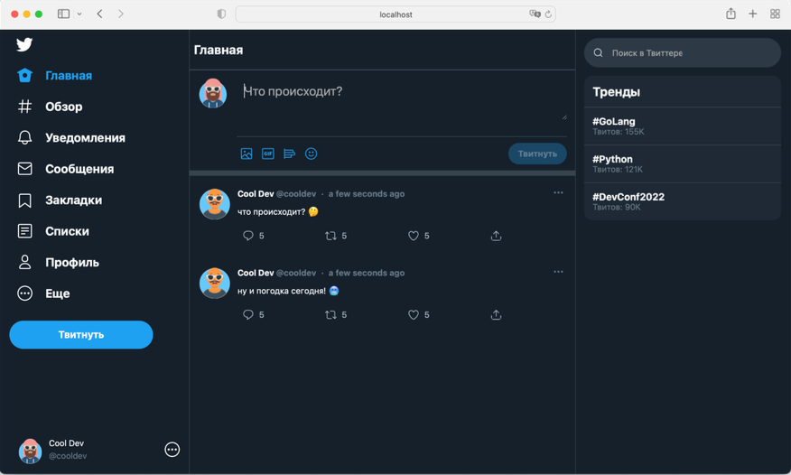
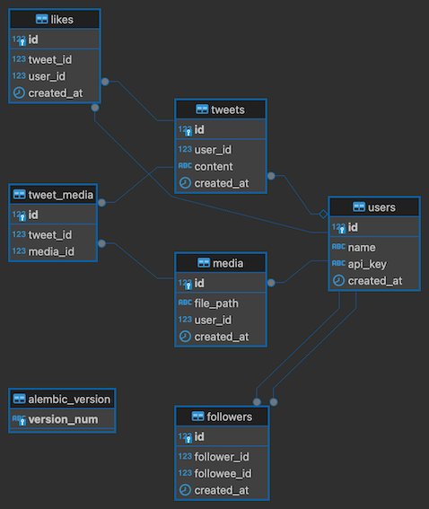

<p align="center">
  
</p>

# 🚀 Сервис микроблогов

Корпоративное приложение для публикации твитов, управления медиафайлами и взаимодействия между пользователями. Реализован функционал добавления твитов, подписки на других пользователей, работы с лайками и загрузки изображений.

---

## 🌐 Демо

Документация API доступна по адресу: [http://127.0.0.1:8000/docs](http://127.0.0.1:8000/docs)

Пример работы:

1. Создание твита.
2. Загрузка изображения.
3. Просмотр ленты твитов.

---

## 🔎 О проекте

**Функционал:**

- Создание и удаление твитов.
- Работа с лайками (добавление и удаление).
- Подписки и отписки между пользователями.
- Загрузка и привязка изображений к твитам.
- Просмотр ленты твитов с сортировкой по популярности.

**Технологии:**

- FastAPI
- PostgreSQL
- SQLAlchemy
- Alembic
- Docker Compose
- Sentry
- Prometheus
- Grafana

**Пример страницы сервиса**



---

## 🔧 Установка и запуск

### 1. Клонирование репозитория
```bash
git clone https://gitlab.skillbox.ru/egor_ilchenko/python_advanced_diploma.git
cd python_advanced_diploma
```

### 2. Настройка окружения
Создайте файл `.env` и заполните его следующими параметрами:
```env
DB_HOST=
DB_PORT=
DB_NAME=
DB_USER=
DB_PASSWORD=
UPLOAD_DIR=
SENTRY_DSN=
```

### 3. Запуск через Docker Compose
```bash
docker-compose up -d
```

Приложение будет доступно по адресу: [http://127.0.0.1:8000](http://127.0.0.1:8000)

---

## 🖋️ API эндпоинты

### 1. Создание твита
**POST** `/api/tweets`

Пример запроса:
```json
{
    "tweet_data": "Пример твита",
    "tweet_media_ids": [1, 2]
}
```
**Ответ:**
```json
{
    "result": true,
    "tweet_id": 123
}
```

### 2. Загрузка медиафайла
**POST** `/api/medias`

Пример запроса (form-data):
```http
file: image.jpg
```
**Ответ:**
```json
{
    "result": true,
    "media_id": 1
}
```

### 3. Лента пользователя
**GET** `/api/tweets`

**Ответ:**
```json
{
    "result": true,
    "tweets": [
        {
            "id": 1,
            "content": "Пример твита",
            "attachments": ["/uploads/1.jpg"],
            "author": {"id": 2, "name": "User1"},
            "likes": [
                {"user_id": 3, "name": "User2"}
            ]
        }
    ]
}
```

---

## 📊 Модели базы данных

Вот описание основных моделей и их связей:

### **User**
- `id` (int, primary key) — уникальный идентификатор пользователя.
- `name` (str) — имя пользователя.

### **Tweet**
- `id` (int, primary key) — уникальный идентификатор твита.
- `content` (str) — текст твита.
- `user_id` (int, foreign key) — ID автора твита.

### **Media**
- `id` (int, primary key) — уникальный идентификатор медиафайла.
- `file_path` (str) — путь к файлу.
- `user_id` (int, foreign key) — ID пользователя, загрузившего файл.

### **Like**
- `id` (int, primary key) — уникальный идентификатор лайка.
- `tweet_id` (int, foreign key) — ID твита.
- `user_id` (int, foreign key) — ID пользователя, поставившего лайк.

### **Follower**
- `id` (int, primary key) — уникальный идентификатор записи.
- `follower_id` (int, foreign key) — ID подписчика.
- `followed_id` (int, foreign key) — ID пользователя, на которого подписались.

---

## 🔄 Схема взаимодействия моделей

```plaintext
User (1) — (N) Tweet
User (1) — (N) Media
User (1) — (N) Like
User (1) — (N) Follower (follower_id -> followed_id)
Tweet (1) — (N) Like
Tweet (1) — (N) Media
```
## 🖼️ ER-Диаграмма


---

## 🔗 Контакты
- **Email**: egor.ilchenko23@list.ru
- **GitHub**: EgorIlchenko

---
